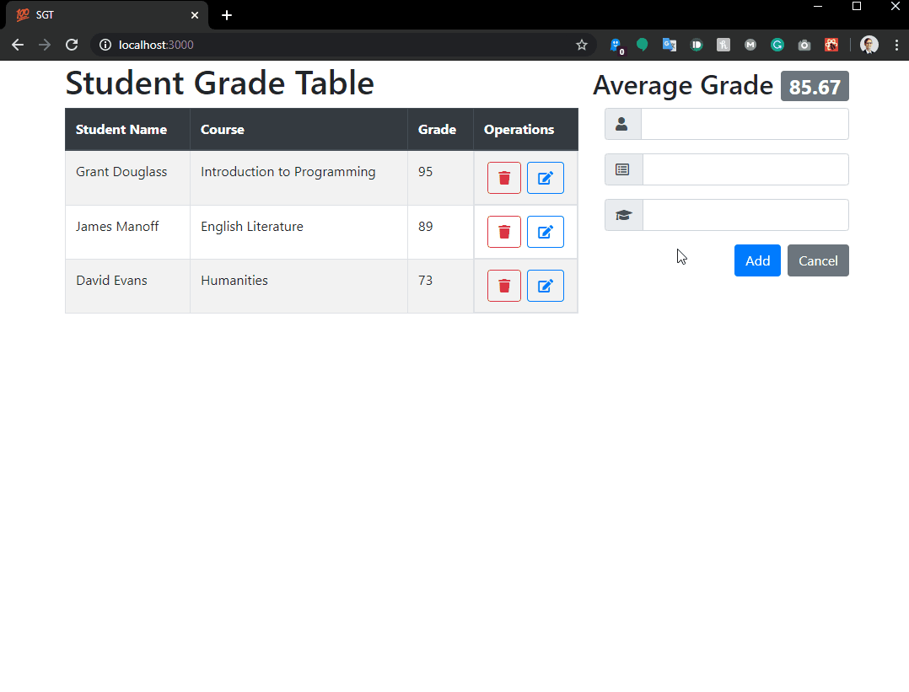
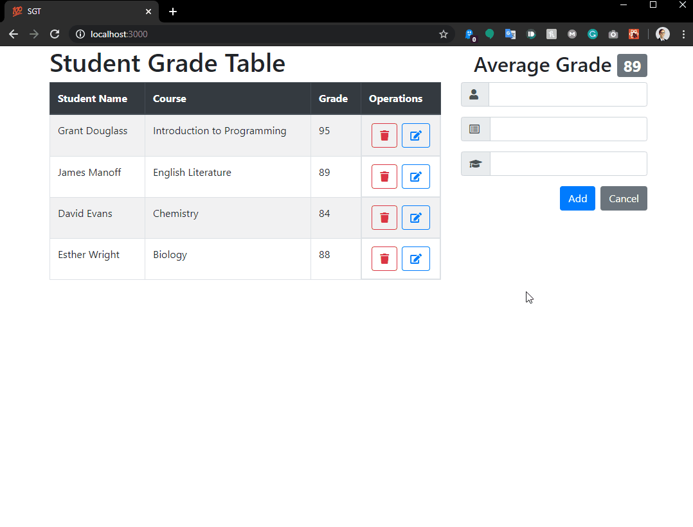
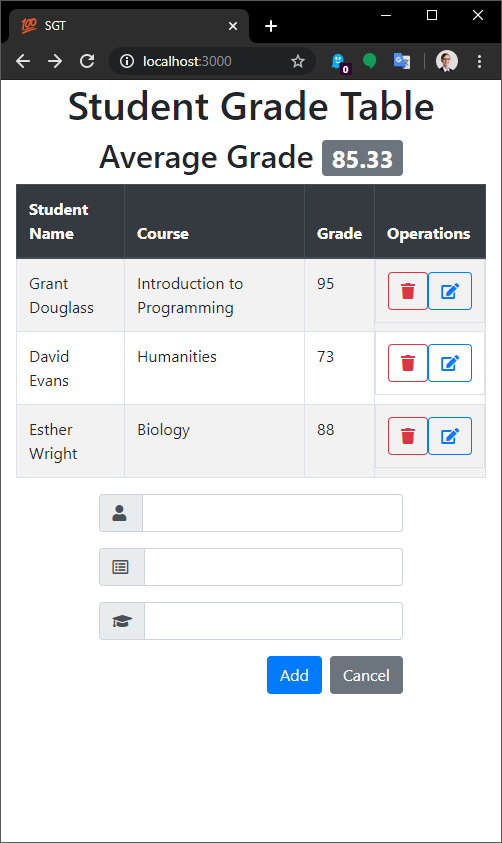

Student Grade Table
=
An interactive JavaScript application that communicates with a server to manage grade records.

### Features
* User can view all grades
* User can view the average grade
* User can add a grade
* User can delete a grade
* User can update a grade.
* User can use the application on a mobile device.

### Dependencies
* npm
* Node.js
* React
* Webpack
* Babel
* Bootstrap 4

### Previews

